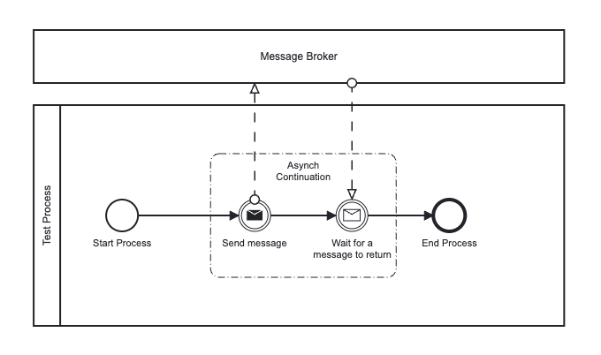

# Camunda 8: Examples
This repository contains code assets which come in handy when using Camunda Platform 8. 

Table of Contents: 
- [Prerequisites](#prerequisites)
- [Message Correlation](#message-correlation)

### Prerequisites
- You need to enroll for a C8 client to connect this client with Camunda 8. You can do so following [this link](https://accounts.cloud.camunda.io/signup).
- Make sure to update the Camunda 8 secrets hen running the project on your own. This needs to be done in the [application.properties](./src/main/resources/application.properties).

### Message Correlation
As you can see in belows process we want to receive and fetch a message from an external system in an asynchronous fashion.
To continue with the right process instance we need to correlate the message.

Camunda's documentation features a good explanation about this concept as well. Apparently the code is missing. 
Hence, I decided to create this as an example for this repo. 
[Camunda's message correlation docu](https://docs.camunda.io/docs/guides/message-correlation/)

The process gets started in the [ProcessStarter class](./src/main/java/com/camunda8/examples/ProcessStarter.java) every five seconds.
While doing so we are setting a BusinessKey as variable which is relevant for the correlation later on.
Having done so the [JobWorker](./src/main/java/com/camunda8/examples/ExampleJobWorkers.java) to send the message is being executed. 
To mock the communication with another system we are simply going to coll the [Message Correlation](./src/main/java/com/camunda8/examples/ExampleMessageCorrelation.java) 
asynchronously which waits 2 seconds before actually correlating the message. 

Take a look on the BPMN file for this [here](./src/main/resources/BPMN/MessageCorrelation.bpmn).

#### Triggering another process to start while correlating a message
It is possible to start another process featuring the same global message reference whilst correlating the message from the example before. 
This is exemplary modeled in the [MessageStartEvent.bpmn](./src/main/resources/BPMN/MessageStartEvent.bpmn) file.